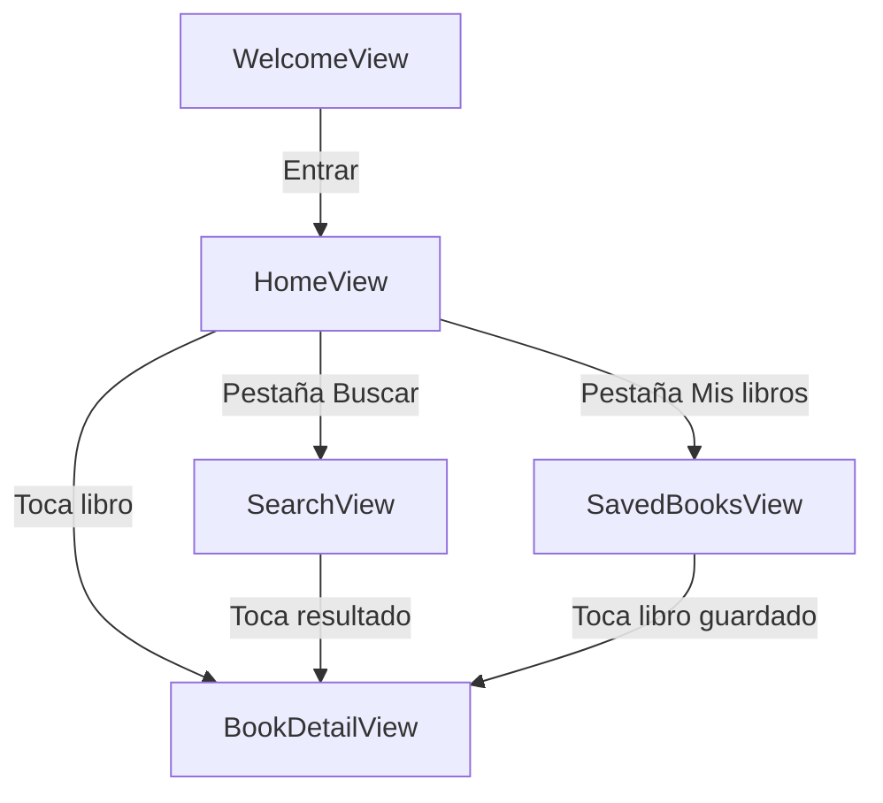

# AJBooks — Navegación y organización del estado

Este documento analiza la estructura de AJBooks antes de implementarla.
Define qué pantallas tiene el MVP, cómo se conectan, qué información usa cada una y dónde vive cada dato.

---

## 1. Mapa de navegación de las pantallas del MVP

Se tienen 5 vistas:

| Pantalla | Vista SwiftUI |
| :--- | :--- |
| Bienvenida con botón "Entrar" | `WelcomeView` |
| Inicio / Catálogo de libros | `HomeView` |
| Buscar | `SearchView` |
| Detalle del libro | `BookDetailView` |
| Libros guardados | `SavedBooksView` |



De esta forma, los flujos mínimos del MVP son:

### Inicio → Lista de libros → Detalle

`WelcomeView` → `HomeView` → `BookDetailView`

`HomeView` despliega recomendaciones o tendencias. Al pulsar una tarjeta se abre `BookDetailView`.

### Buscar → Resultados → Detalle

`HomeView` → `SearchView` → `BookDetailView`

`SearchView` recibe la entrada del usuario, realiza la consulta a Open Library y muestra resultados. Al seleccionar un resultado se abre `BookDetailView`.

### Mis libros → Libro guardado → Detalle

`HomeView` → `SavedBooksView` → `BookDetailView`

`SavedBooksView` carga la lista. Al seleccionar un libro guardado se abre `BookDetailView`.

---

## 2. Información por pantalla

### A. WelcomeView (Pantalla de Bienvenida)

* **Muestra:** Logotipo/Marca (AJBooks), mensaje de bienvenida y botón "Entrar".
* **Recibe:** Nada (vista inicial).
* **Modifica:** Estado de autenticación/acceso.
* **Conserva:** Preferencia de bienvenida.

### B. HomeView (Inicio / Catálogo General)

* **Muestra:** Lista destacada de libros obtenidos de Open Library, estados de *loading*, *error* y *sin portada*.
* **Recibe:** Lista de entidades `Book`.
* **Modifica:** Estado de carga, selección de libro para vista detallada.
* **Conserva:** Caché temporal en memoria de la lista principal.

### C. SearchView (Búsqueda y Resultados)

* **Muestra:** `Searchable`/`TextField` para la consulta, lista de resultados de Open Library con título, autor, año y portada (si está disponible), estados de *sin resultados*, *cargando* y *error*.
* **Recibe:** Texto ingresado por el usuario.
* **Modifica:** Lista de resultados devueltos por la API de Open Library, estado de favorito/corazón de un libro en tiempo real.
* **Conserva:** Texto de búsqueda actual.

### D. SavedBooksView (Mis Libros / Favoritos)

* **Muestra:** Colección personal de libros guardados localmente, contador de libros en la colección, estado de lista vacía cuando no hay registros guardados.
* **Recibe:** Arreglo de libros guardados.
* **Modifica:** Eliminación de libros guardados (botón de papelera), actualización de la lista.
* **Conserva:** La colección completa de libros guardados en el almacenamiento del dispositivo.

### E. BookDetailView (Detalle del Libro - Modal / Sheet)

* **Muestra:** Portada, título, autores, año de publicación, descripción, botón de cerrar y botón de favorito/guardar (corazón).
* **Recibe:** Un objeto de tipo `Book` o un identificador único.
* **Modifica:** Estado de guardado del libro (añadir/eliminar de favoritos).
* **Conserva:** Sincronización del estado guardado con la base de datos local.

---

## 3. Organización del estado

| Dato / Propiedad | Ubicación | Justificación técnica |
| :--- | :--- | :--- |
| **Búsqueda (`searchQuery`)** | `SearchViewModel` | Es un estado exclusivo de la pantalla de búsqueda. No requiere vivir en el ámbito global. |
| **Resultados de búsqueda / Libros de Inicio** | `SearchViewModel` / `HomeViewModel` | Los resultados son manejados por la lógica de presentación y transformados en la interfaz (*Loading*, *Success*, *Error*, *Empty*). |
| **Lista de libros guardados** | `SavedBooksRepository` / `PersistenceController` | Debe ser el **único origen de la verdad (Single Source of Truth)**. Garantiza que si un libro se guarda o elimina desde el detalle o la búsqueda, todas las pantallas se actualicen automáticamente. |
| **Libro seleccionado** | `HomeViewModel` | Maneja la presentación de `.sheet(item: $selectedBook)`. Cuando `selectedBook` no es `nil`, se despliega la vista detallada. |

### Justificación de la arquitectura de estado

1. **Desacoplamiento de networking:** Los ViewModels consumen un protocolo `OpenLibraryServiceProtocol`, evitando que las vistas de SwiftUI hagan peticiones HTTP directamente.
2. **Persistencia centralizada:** Los libros guardados se manejan mediante un repositorio que encapsula SwiftData. Las vistas reaccionan a los cambios de la base de datos sin acoplar la UI a la tecnología de almacenamiento.
3. **Manejo de estados de UI:** Se utiliza un tipo `enum` para representar las fases de la interfaz:

```swift
enum ViewState<T> {
    case idle
    case loading
    case loaded(T)
    case empty
    case error(String)
}
```

---

## 4. Estrategia de navegación

### Navegación principal

Al abrir la aplicación, el usuario ve la pantalla de bienvenida. Al presionar el botón **"Entrar"**, se autentica/inicia la sesión y es redirigido automáticamente al catálogo general de la aplicación.

Se utilizará un `TabView` como contenedor principal tras presionar "Entrar" en la pantalla de bienvenida.

### Navegación por pestañas (barra inferior)

Tras entrar, el usuario se desplaza entre los tres flujos principales del sistema mediante la barra de navegación inferior (`HomeView`, `SearchView` y `SavedBooksView`).

Se implementa un `TabView` con un `enum` de selección:

```swift
enum Tab {
    case home, search, saved
}
```

### Navegación de detalle

En cualquiera de las pantallas principales, al presionar sobre la tarjeta de un libro se despliega la vista extendida. Al tocar la "X" superior o deslizar hacia abajo, la tarjeta se cierra y el usuario regresa al listado previo.

Se utiliza el modificador `.sheet(item:)` asociado al estado del libro. Cuando la variable `$selectedBook` deja de ser `nil`, SwiftUI presenta la vista de forma automática.

---

## Accesibilidad

**Botón Corazón (Favorito):**

```swift
.accessibilityLabel(isFavorite ? "Eliminar de favoritos" : "Agregar a favoritos")
.accessibilityHint("Guarda este libro en tu lista personalizada.")
```

**Botón Cierre Modal (X):**

```swift
.accessibilityLabel("Cerrar detalles")
.accessibilityHint("Regresa a la pantalla anterior.")
```

**Botón Eliminar (Bote de basura):**

```swift
.accessibilityLabel("Eliminar \(book.title)")
.accessibilityHint("Quita este libro de tu lista de favoritos.")
```
